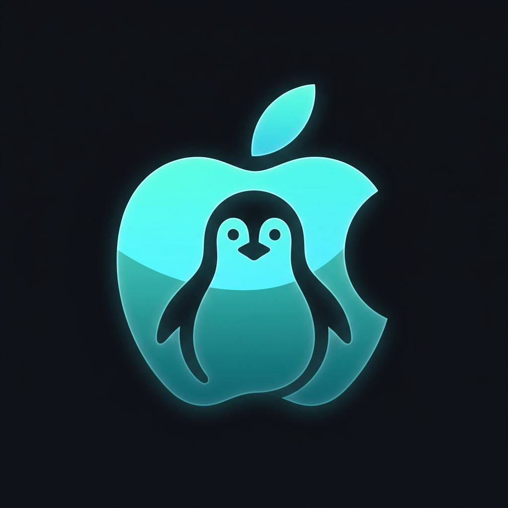

<p align="center">
  
</p>

<h1 align="center">MacNix OS</h1>

<p align="center">
  <b>The Ultimate macOS Virtualization Distro. One USB, one boot, native GPU performance.</b>
</p>

---

**MacNix** is a dedicated, specialized Linux distribution built from the ground up to do exactly one thing: **run macOS with near-native performance using KVM/QEMU and automated VFIO GPU passthrough.**

No more complex Arch Linux setups, no more manual IOMMU group tweaking, and no more OpenCore configuration headaches. Boot from USB, follow the beautiful installer, and reboot into macOS.

## ✨ Features

- **Automated GPU Passthrough**: Automatically isolates and passes through your dedicated NVIDIA, AMD, or Intel GPU to the macOS guest.
- **Dynamic OpenCore Generation**: Automatically writes a tailor-made `config.plist` based on your hardware profile.
- **Single-GPU Support**: Includes custom libvirt hooks to seamlessly detach your GPU from Linux and attach it to macOS, giving you full hardware acceleration.
- **Recovery Fetcher**: Automatically downloads the latest macOS Recovery image during installation.
- **Zero Configuration**: A fully customized Calamares installer handles the entire KVM, network bridge, and VFIO setup.

## 🚀 How to Build

MacNix uses `live-build` to generate the ISO. 

If you are running on Debian/Ubuntu, you can build it locally:
```bash
sudo apt-get install live-build debootstrap xorriso grub-efi-amd64-bin grub-pc-bin mtools dosfstools isolinux syslinux-common
sudo bash scripts/phase7-build-iso.sh
```

Alternatively, use the included **GitHub Actions CI**. Push your changes to the `main` or `master` branch, and GitHub will automatically compile the ISO and provide it as a downloadable artifact.

## 🤝 Support & Donate

If MacNix has saved you days of Hackintosh/VFIO headaches, consider supporting the project! Every contribution matters. 🙏

**USDT (TON Network):**
```text
UQBEJwLa4EGPRmUKw4O1i9d_JjJGmjkJ2myqR5lborzgceT-
```

Created by **[Hassan Elkady](https://github.com/local-over)**.

---
*Disclaimer: MacNix is an educational virtualization project. Please comply with Apple's EULA regarding macOS virtualization.*
